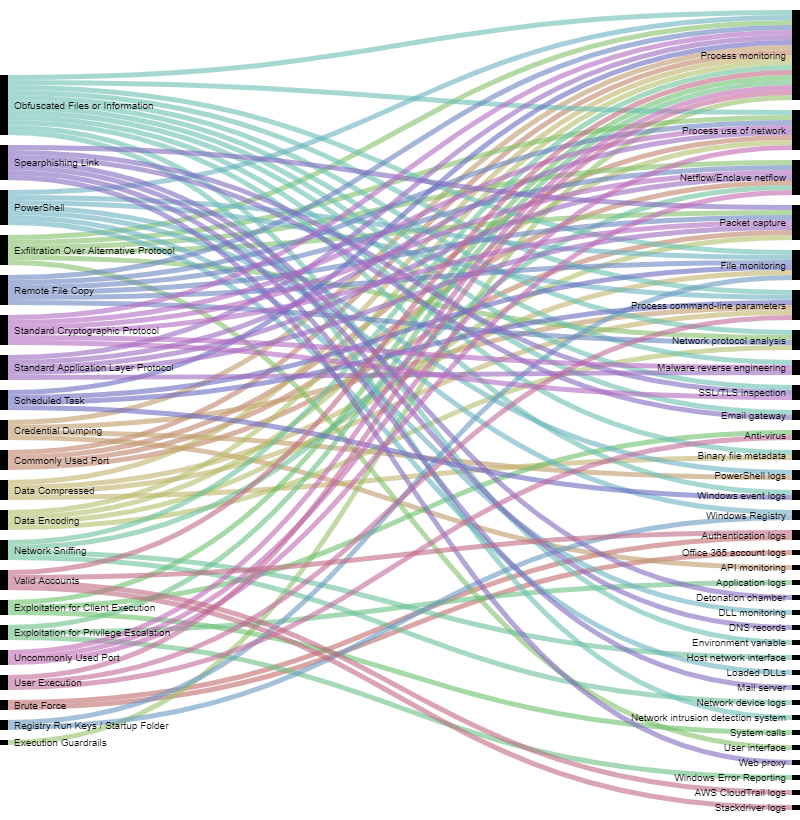

# MITRE ATT&CK Group CTI Automation

Automatically retrieve all techniques and detection data sources for a MITRE ATT&CK threat group and export them to CSV for visualization.

Based on the [MITRE ATT&CK STIX data repository](https://github.com/mitre-attack/attack-stix-data) — compatible with **ATT&CK v18.1** (latest).

The CSV output can be uploaded to [RawGraphs](https://app.rawgraphs.io/) for visualization of the relationships between techniques and detection data sources.



---

## Requirements

- Python 3.10+
- [`mitreattack-python`](https://github.com/mitre-attack/mitreattack-python) >= 5.4.4

## Installation

```bash
pip install -r requirements.txt
```

---

## Usage

```
python3 get_techniques_data_sources_from_group.py -g <group_name> [options]
```

### Options

| Option | Description |
|--------|-------------|
| `-g`, `--group` | ATT&CK group name or alias (e.g. `APT33`) |
| `-o`, `--output` | Output CSV file path (default: `techniques_datasource.csv`) |
| `--stix-data` | Local path or URL to ATT&CK STIX JSON (default: latest from GitHub) |
| `--list-groups` | Print all known group names and exit |
| `-h`, `--help` | Show help message and exit |

### Examples

```bash
# Get techniques and data sources for APT33
python3 get_techniques_data_sources_from_group.py -g APT33

# Custom output file
python3 get_techniques_data_sources_from_group.py -g Lazarus -o lazarus.csv

# List all available groups
python3 get_techniques_data_sources_from_group.py --list-groups

# Use a locally downloaded STIX file (offline mode)
python3 get_techniques_data_sources_from_group.py -g APT33 --stix-data ./enterprise-attack.json
```

> On first run, the STIX data (~50MB) is downloaded from GitHub and cached at
> `~/.cache/mitre-attack/enterprise-attack.json`. Subsequent runs reuse the cache.

---

## Output

A CSV file with two columns:

| technique | data source |
|-----------|-------------|
| Spearphishing Attachment | Application Log: Application Log Content |
| ... | ... |

Upload the CSV to [https://app.rawgraphs.io/](https://app.rawgraphs.io/) to generate interactive visualizations.
